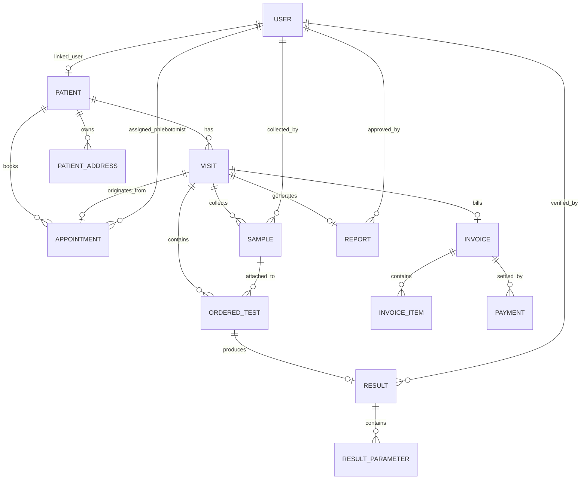
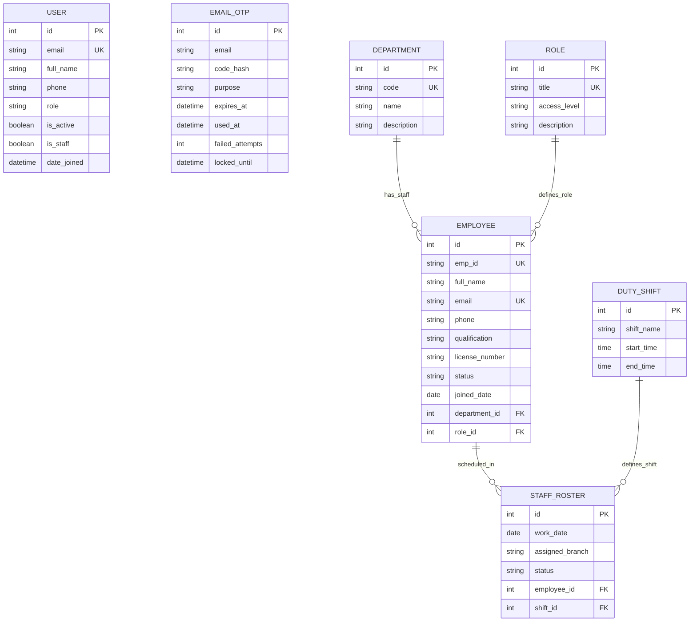
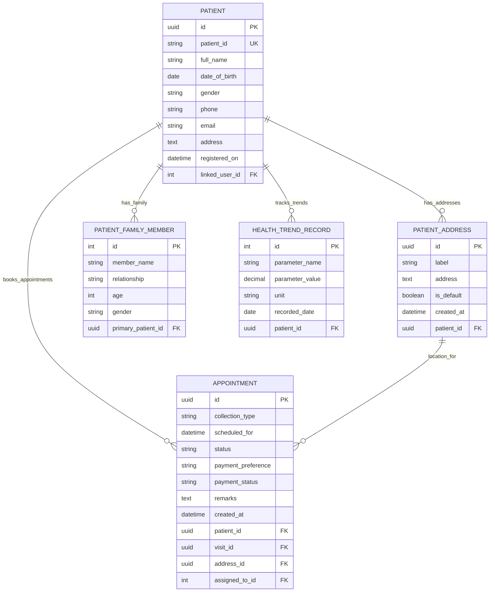
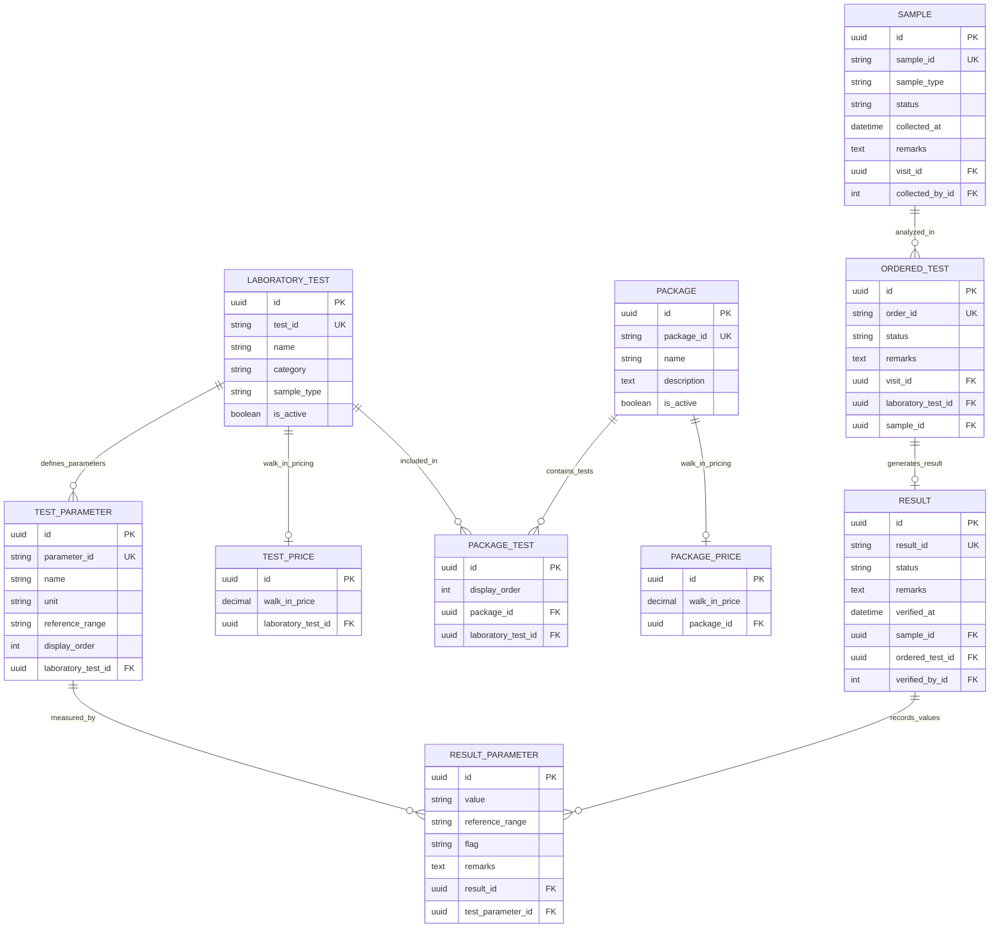
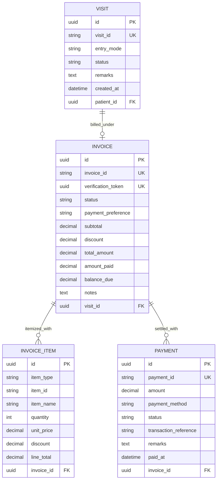
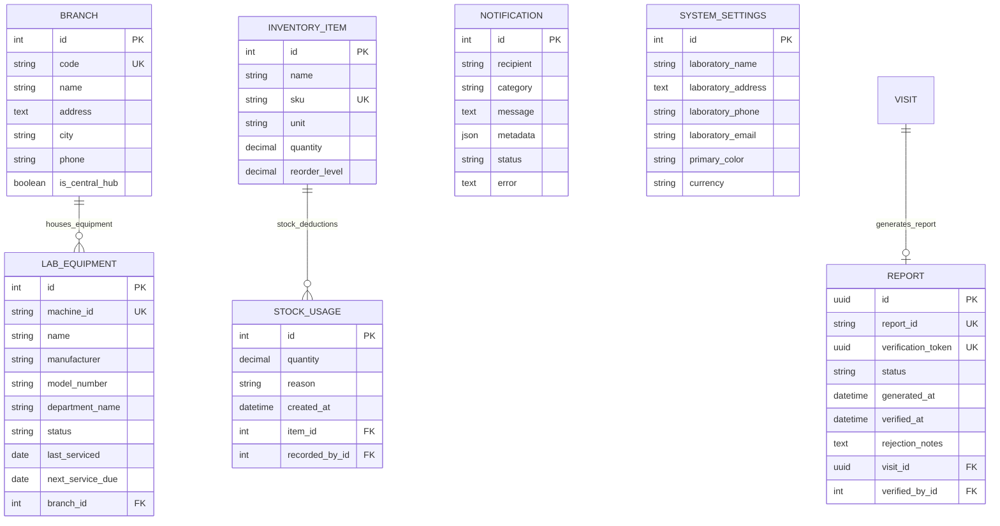

# 🔬 Life Line Diagnostics — Pathology Information System & LIMS

[](https://lifeline-diagnostics.vercel.app)
[](https://lifeline-diagnostics.onrender.com)
[](https://lifeline-diagnostics.vercel.app)
[](https://python.org)
[](https://djangoproject.com)
[](https://reactjs.org)

**Life Line Diagnostics** is an enterprise-grade, NABL-accredited **Laboratory Information Management System (LIMS)** and Pathology Information Platform. Designed for modern diagnostic laboratories, home specimen collection fleets, and multi-branch healthcare centers, it automates the full patient lifecycle—from online booking and accessioning to automated clinical flagging, pathologist sign-off, NABL PDF report generation, and billing.

---

## 🌐 Live Production Deployments

* 🌐 **Live Web Application**: [https://lifeline-diagnostics.vercel.app](https://lifeline-diagnostics.vercel.app)
* ⚡ **Live REST API Backend**: [https://lifeline-diagnostics.onrender.com](https://lifeline-diagnostics.onrender.com)

---

## 💡 Executive Summary & Core Workflow

```
[ Patient / Chatbot ] ──► [ Online / Walk-in Booking ] ──► [ Accessioning (LLD-B-XXXXXX) ]
                                                                      │
[ NABL PDF Report ] ◄── [ Pathologist Review ] ◄── [ Auto Flagging ] ◄┴── [ Specimen Collection ]
      │                                                (HIGH/LOW)
      ▼
[ QR Code Verification ]
```

### Key Workflow Highlights

1. **Specimen Accessioning & Barcode Engine (`LLD-B-XXXXXX`)**:
   - Thread-safe, atomic business ID sequence generator preventing barcode collisions across multi-branch and concurrent walk-in/online traffic.
2. **Automated Clinical Range Flagging**:
   - Dynamic numerical reference range engine calculating parameter flags (`NORMAL`, `HIGH` ↑, `LOW` ↓) based on standard age and gender clinical benchmarks.
3. **NABL-Compliant PDF Report Generator with QR Verification**:
   - Programmatic PDF generation powered by **ReportLab** with a 2-pass `NumberedCanvas` page numbering engine, custom letterhead branding, and anti-tamper QR code verification URLs.
4. **LifeLong AI Booking Assistant & Guardrails**:
   - OpenAI GPT-driven interactive assistant aiding patients with test catalog discovery, preparation instructions, and 1-click appointment booking with out-of-scope clinical guardrails.
5. **Role-Based Workstation Dashboards (RBAC)**:
   - Dedicated interactive interfaces tailored for **Owners/Admins**, **Pathologists**, **Lab Technicians**, **Reception Desk**, **Phlebotomists**, and **Patients**.
6. **Billing & Financial Management Engine**:
   - Automatic invoice compilation supporting tests & packages, customizable discounts, multiple payment modes (Cash, UPI, Card, NetBanking), and payment tracking (Paid, Unpaid, Partially Paid).
7. **Fleet, Equipment & Roster Operations**:
   - Real-time analyzer equipment monitoring (operational status, calibration due dates) and employee shift rostering across diagnostic hubs.

---

## 🛠️ Technology Stack

| Domain | Technology / Library | Description |
| :--- | :--- | :--- |
| **Frontend Framework** | React 18 + Vite | High-performance Single Page Application (SPA) |
| **State & Routing** | React Router v6 | Client-side view routing & layout management |
| **Styling & UI** | TailwindCSS + Framer Motion | Modern design system, fluid transitions, and responsive layout |
| **Icons** | Lucide React | Clean, scalable UI icon system |
| **Backend Framework** | Python 3.11 + Django 5.0 | High-reliability web framework with Django REST Framework (DRF) |
| **Authentication** | SimpleJWT + Email OTP | JSON Web Tokens with passwordless OTP verification fallback |
| **Document Engine** | ReportLab + Python-QRCode | Programmatic NABL PDF generation with embedded QR codes |
| **Database** | MySQL 9.7 / SQLite3 | MySQL in production (Render), SQLite3 for local development |
| **Asset Delivery** | WhiteNoise | Compressed static file serving for Django |
| **Cloud Hosting** | Vercel (Frontend) + Render (Backend) | CI/CD automated cloud deployment pipelines |

---

## 📐 Database Architecture & Entity-Relationship (ER) Diagrams

The database schema is structured into modular domain apps handling specific functional areas.

### 1. High-Level Core ER Overview

This diagram displays the primary domain relationships connecting Users, Patients, Appointments, Visits, Samples, Results, Invoices, and Reports.



---

### 2. User Authentication & Employee Management Domain

Manages role-based access control (RBAC), staff directories, departments, duty shifts, and staff rosters.



---

### 3. Patient & Appointment Scheduling Domain

Stores patient demographic profiles, multiple delivery/collection addresses, family members, health trends, and appointment bookings.



---

### 4. Laboratory Catalog & Test Execution Domain

Core diagnostic module managing test definitions, sub-parameters, packages, pricing models, specimen collection, test orders, and flagged results.



---

### 5. Billing, Invoicing & Financial Operations Domain

Handles financial records for patient visits, line items, and payment transactions.



---

### 6. Branch Fleet, Reports, Notifications & System Config Domain

Covers lab equipment management, NABL report tracking, email notifications, activity logs, and global system parameters.



---

## 📂 Repository Structure

```
lifeline-diagnostics/
├── backend/                             # Django 5.0 REST Backend
│   ├── accounts/                        # Custom User Model, JWT & Email OTP Auth
│   ├── patients/                        # Patient Registry & Multiple Delivery Addresses
│   ├── visits/                          # Clinical Visits & Appointment Scheduler
│   ├── laboratory/                      # Test Catalog, Parameters, Samples, Results & Flagging
│   ├── billing/                         # Invoices, Line Items & Multi-Method Payments
│   ├── reports/                         # ReportLab NABL PDF Generator & QR Verification
│   ├── inventory/                       # Reagent Stock Tracking & Usage Logs
│   ├── employees/                       # Employee Profiles, Departments, Roles & Duty Rosters
│   ├── branches/                        # Hub & Spoke Branches & Analyzer Equipment Fleet
│   ├── notifications/                   # Multi-Channel Email & System Alert Engine
│   ├── patient_portal/                  # Patient Family Accounts & Health Trend Analytics
│   ├── common/                          # Atomic Business ID Sequence & Exceptions
│   ├── config/                          # Django Settings, CORS, WSGI/ASGI Settings
│   └── manage.py                        # Django Management CLI
├── src/                                 # React 18 SPA Frontend
│   ├── components/                      # AI Chatbot, Favicon, QR Inspector, Navigation
│   ├── features/                        # Role Workstations (Technician, Pathologist, Admin, Patient)
│   ├── layouts/                         # App Header, Sidebar Navigation & Alert Trays
│   ├── services/                        # Axios API Client & JWT Token Refresh Interceptors
│   ├── App.tsx                          # Primary Route Declarations
│   └── main.tsx                         # React Mount Point
├── public/                              # Dynamic Favicon & Emblem Branding Assets
├── DEPLOYMENT.md                        # Production Deployment & Environment Setup Guide
├── index.html                           # SPA HTML Shell
├── package.json                         # Node.js Dependencies & Build Scripts
├── vite.config.ts                       # Vite Bundler Configuration
└── README.md                            # Comprehensive Repository Documentation
```

---

## 🚀 Quick Start & Local Setup

### Prerequisites
* **Node.js** >= 18.x
* **Python** >= 3.11
* **Virtualenv** (`pip install virtualenv`)

### 1. Backend Setup (Django REST API)

```bash
# 1. Navigate to backend directory
cd backend

# 2. Create and activate Python virtual environment
python3 -m venv venv
source venv/bin/activate  # On Windows: venv\Scripts\activate

# 3. Install backend dependencies
pip install -r requirements.txt

# 4. Run database migrations
python manage.py migrate

# 5. Seed full test catalog and sample data
python manage.py seed_full_catalog

# 6. Start Django development server (listening on http://127.0.0.1:8000)
python manage.py runserver 8000
```

### 2. Frontend Setup (React + Vite)

```bash
# 1. Open root repository directory
cd ..

# 2. Install Node dependencies
npm install

# 3. Start Vite dev server (runs on http://localhost:3000)
npm run dev
```

---

## 📜 Accreditation & Helplines

* **NABL Accreditation**: Accredited in Clinical Pathology, Hematology & Biochemistry
* **ISO Certification**: ISO 9001:2015 Certified Diagnostic Facility
* **Helpline Support**: +91 96033 48519
* **Main Reference Lab**: MG Road, Vijayawada, Andhra Pradesh, India

---

*Developed for Life Line Diagnostics — Advanced Pathology Information Systems.*
